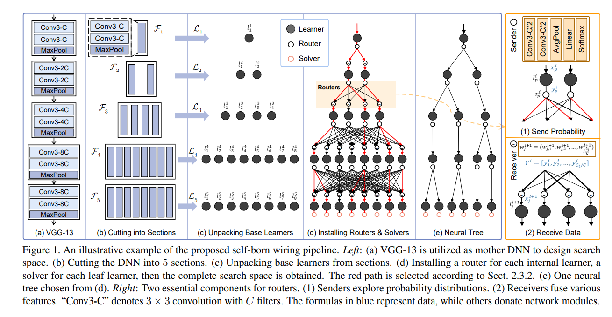

# SeBoW: Self-Born Wiring for neural trees(PaddlePaddle version)

This is the paddle code for SeBoW(Self-Born wiring for neural trees), a kind of neural decision tree born form a large search space, published as a
conference paper on ICCV 2021, written by [Ying Chen](https://www.vipazoo.cn/people/chenying.html) et al.
The code was written by [Haoling Li](https://github.com/HollyLee2000) and Ying Chen, and supported by Jie Song.
This paddle implementation produces results comparable to the original PyTorch veision. 

## Prerequisites
- Linux or Window
- Python 3
- CPU or NVIDIA GPU + CUDA CuDNN

## Getting Started
### Installation
- Clone this repo:
```bash
git clone https://github.com/HollyLee2000/SeBoW-paddle
cd SeBoW-paddle
```

### train/test introduction
- Edit ForestModel.py to choose your dataset and Forest structure(the original large search space), by now only Cifar100 dataset has been tested on this paddle version. If you want to conduct on other datasets you need just do some adjustment and rewirte the dataloder


- run train_cifar100_ForestModel.py to get the result of the forest model.


- run sender_select.py to get the output of the sender(average router probability for each section of the Forest model), then retain the node in i-th section if its conditional probability obtained from previous senders is greater than the threshold C/(2 × Ci), in the original paper, C=2 and Ci means the number of the learners in i-th section.


- run receiver_droupout.py, choose the only parent of each node with the largest weight in sampling vectors produced by the receiver, then you will get the final tree-structure.


- Edit Forest_to_tree.py to apply your tree-structured model, during the retraining phase you will run train_tree.py to retrain the derived neural tree from scratch


- The inference can be executed in two manners: multi-path inference and single-path inference. Multipath inference computes the weighted predictive distribution by running over all possible paths in the derived neural tree, such that all solvers in the tree will contribute to the final prediction(you have done this). However, in the single-path inference, only the most probable paths are executed based on the routing probability from routers, which enjoys less inference cost with some accuracy drop. You can run single-inference.py to apply this, but don't forget to adjust the structure of Tree_single_inference.py


## Acknowledgments
The work is inspired by [VIPA](https://www.vipazoo.cn/).

